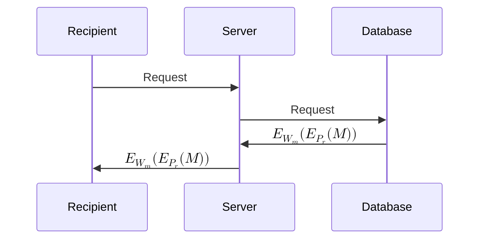

```mermaid
sequenceDiagram
    participant Recipient
    participant Server
    participant Database

    Recipient ->> Server: Request
    Server ->> Database: Request
    Database ->> Server: $$E_{W_m}(E_{P_r}(M))$$
    Server ->> Recipient: $$E_{W_m}(E_{P_r}(M))$$
```