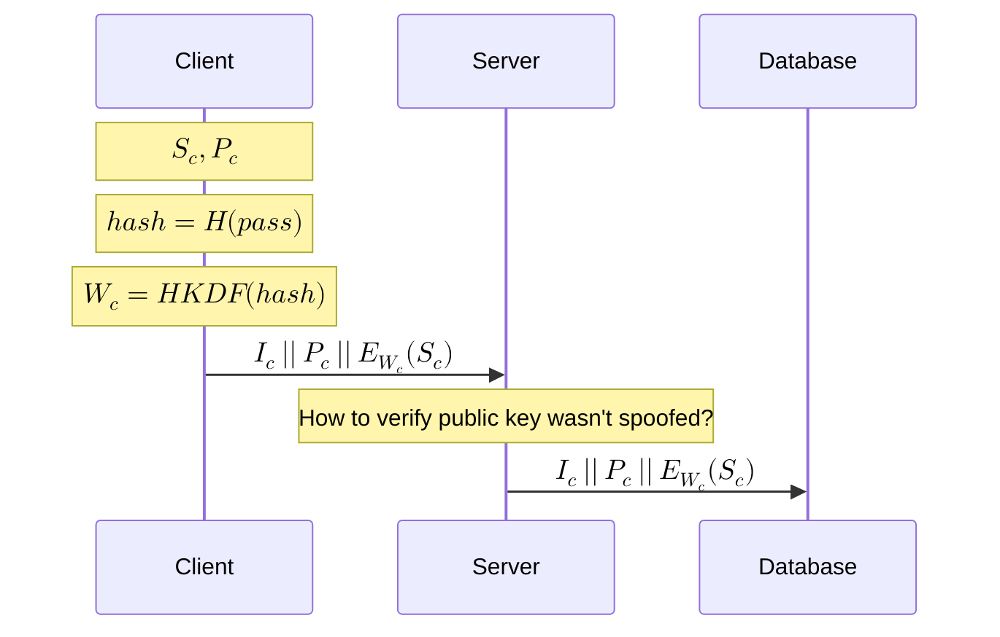

```mermaid
sequenceDiagram
    participant Client
    participant Server
    participant Database

    Note over Client: $$S_c, P_c$$
    Note over Client: $$hash = H(pass)$$
    Note over Client: $$W_c = HKDF(hash)$$

    Client ->> Server: $$I_c\,||\,P_c\,||\,E_{W_c}(S_c)$$

    Note over Server: How to verify public key wasn't spoofed?

    Server ->> Database: $$I_c\,||\,P_c\,||\,E_{W_c}(S_c)$$
```