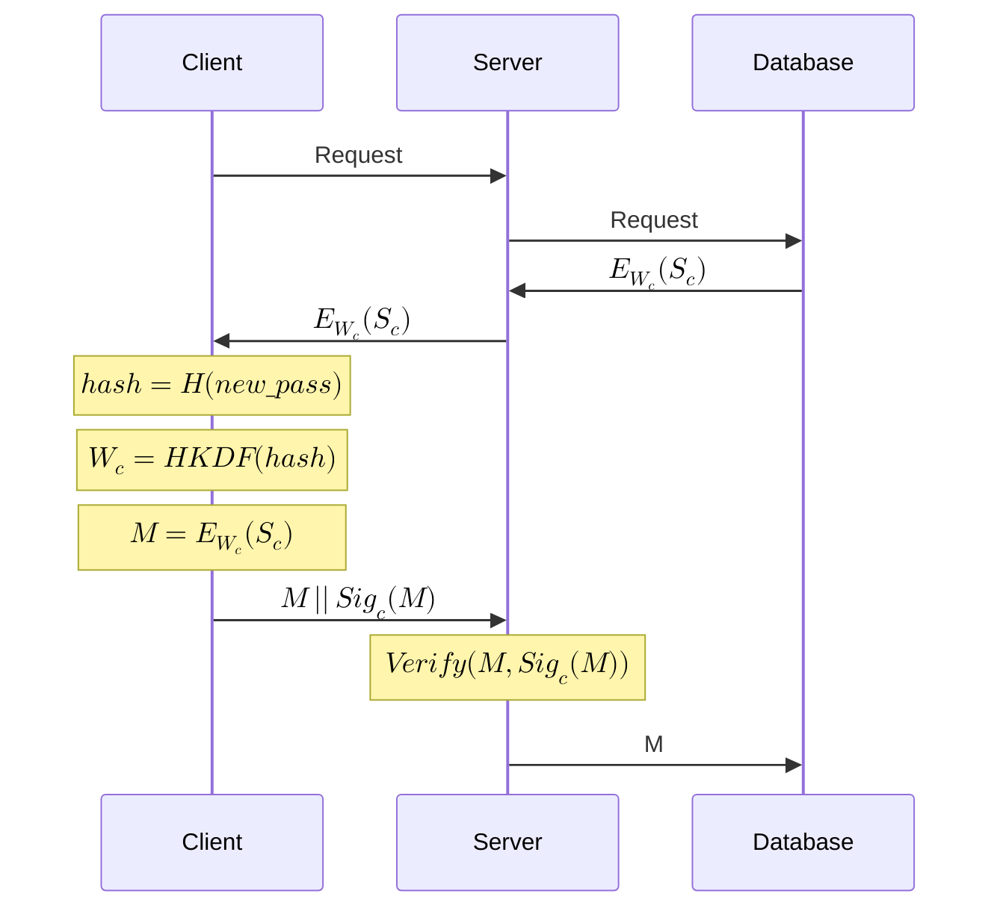

```mermaid
sequenceDiagram
    participant Client
    participant Server
    participant Database

    Client ->> Server: Request
    Server ->> Database: Request
    Database ->> Server: $$E_{W_c}(S_c)$$
    Server ->> Client: $$E_{W_c}(S_c)$$

    Note over Client: $$hash = H(new\_pass)$$
    Note over Client: $$W_c = HKDF(hash)$$
    Note over Client: $$M = E_{W_c}(S_c)$$

    Client ->> Server: $$M\,||\,Sig_c(M)$$

    Note over Server: $$Verify(M, Sig_c(M))$$
    
    Server ->> Database: M

```