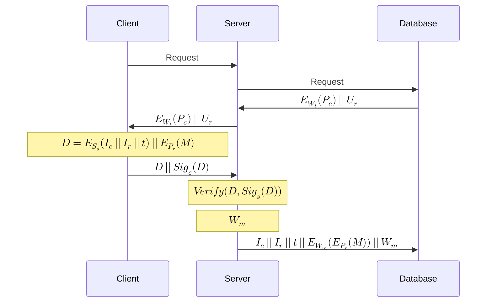

```mermaid
sequenceDiagram
    participant Client
    participant Server
    participant Database

    Client ->> Server: Request
    Server ->> Database: Request
    Database ->> Server: $$E_{W_t}(P_c)\,||\,U_r$$
    Server ->> Client: $$E_{W_t}(P_c)\,||\,U_r$$
    
    Note over Client: $$D = E_{S_s}(I_c \,||\, I_r \,||\, t) \,||\, E_{P_r}(M)$$

    Client ->> Server: $$D\,||\, Sig_{c}(D)$$

    Note over Server: $$Verify(D, Sig_s(D))$$
    Note over Server: $$W_m$$

    Server ->> Database: $$I_c \,||\, I_r \,||\, t \,||\, E_{W_m}(E_{P_r}(M)) \,||\, W_m$$

```