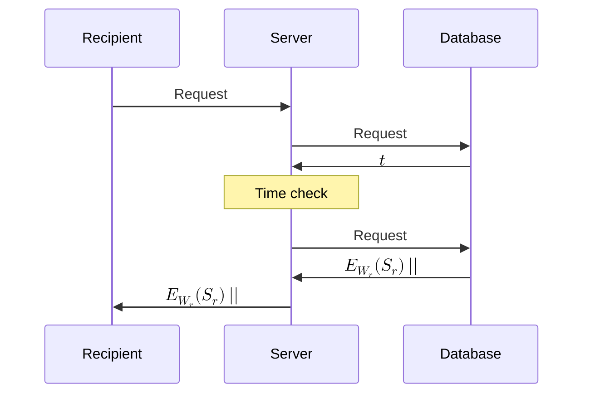

```mermaid
sequenceDiagram
    participant Recipient
    participant Server

    Recipient ->> Server: Request

    Server ->> Database: Request
    Database ->> Server: $$t$$

    Note over Server: Time check

    Server ->> Database: Request
    Database ->> Server: $$E_{W_r}(S_r) \,||\, $$
    Server ->> Recipient: $$E_{W_r}(S_r) \,||\, $$
```